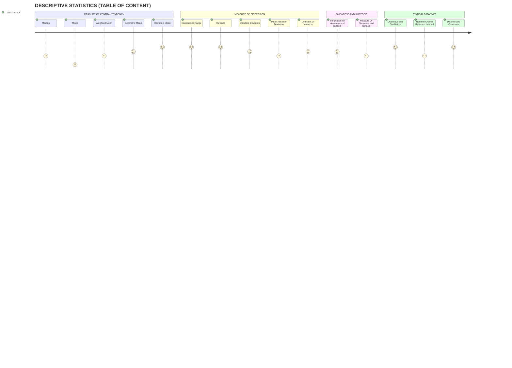

# 📊 Descriptive Statistics (Table of Contents)

## 📈 Measure of Central Tendency
- Median 📏
- Mode 📊
- Weighted Mean 📉
- Geometric Mean 📐
- Harmonic Mean 🧮

## 📉 Measure of Dispersion
- Interquartile Range 📊
- Variance 📈
- Standard Deviation 📉
- Mean Absolute Deviation 📈
- Coefficient of Variation 📊

## 📣 Skewness and Kurtosis
- Interpretation of Skewness and Kurtosis 📈
- Measure of Skewness and Kurtosis 📏

## 📊 Statistical Data Type
- Quantitative and Qualitative 📈📊
- Nominal, Ordinal, Ratio, and Interval 📏📈📉
- Discrete and Continuous 📈📉

